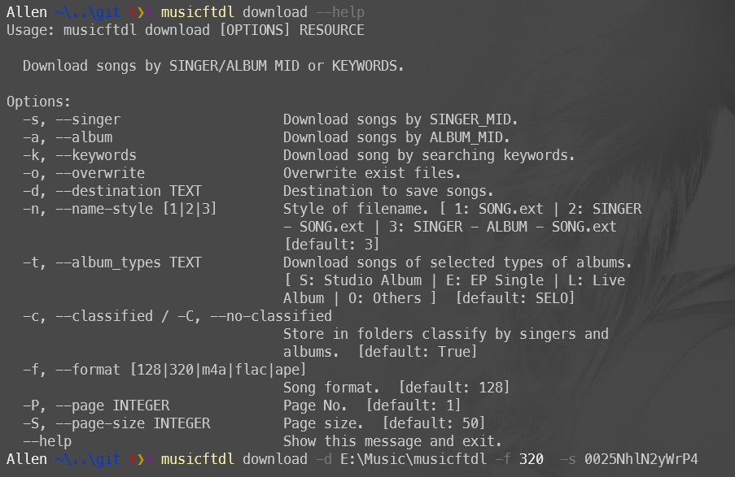

=========================
Music Full Tag Downloader
=========================

.. image:: https://img.shields.io/pypi/v/musicftdl.svg
        :target: https://pypi.python.org/pypi/musicftdl

.. image:: https://img.shields.io/travis/lonsty/musicftdl.svg
        :target: https://travis-ci.com/lonsty/musicftdl

.. image:: https://readthedocs.org/projects/musicftdl/badge/?version=latest
        :target: https://musicftdl.readthedocs.io/en/latest/?badge=latest
        :alt: Documentation Status

A CLI tool to download music of Jay Chou and other singers with full song tags.

* Free software: MIT license
* Documentation: https://musicftdl.readthedocs.io.

Features
--------

* **Search**: Search songs by keywords.
* **Download**: Download song(s) by singer/album/song mid or keyword.
* **Tag**: After downloading, tags are automatically added to the song (eg artist, album, sum of tracks, album cover image, release date), this feature is only available for `MP3` format songs.

Usage
-----

.. code-block:: console

    $ pip install -U musicftdl

Example for downloading all `周杰伦's` songs with `320k` bitrate, and save to the directory of `/mnt/e/Music/musicftdl` :

.. code-block:: console

    $ musicftdl download -d /mnt/e/Music/musicftdl -f 320 -s 0025NhlN2yWrP4

